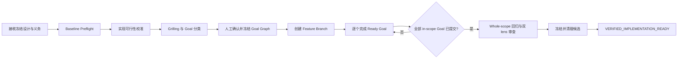
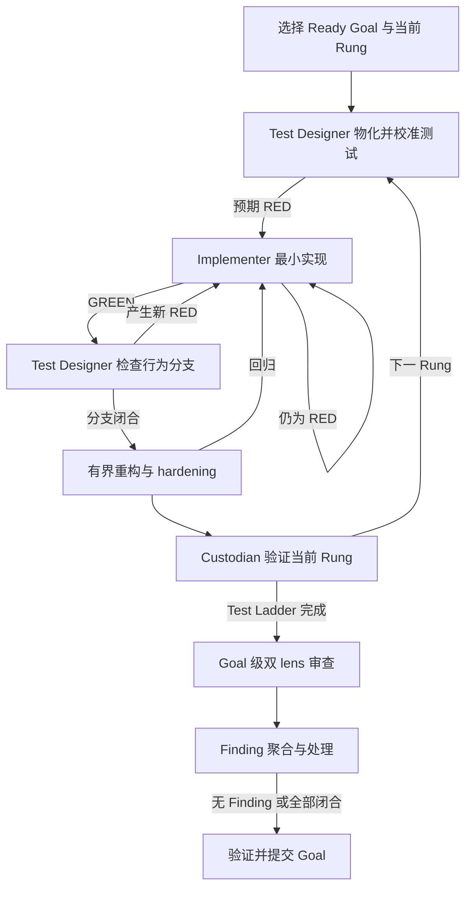
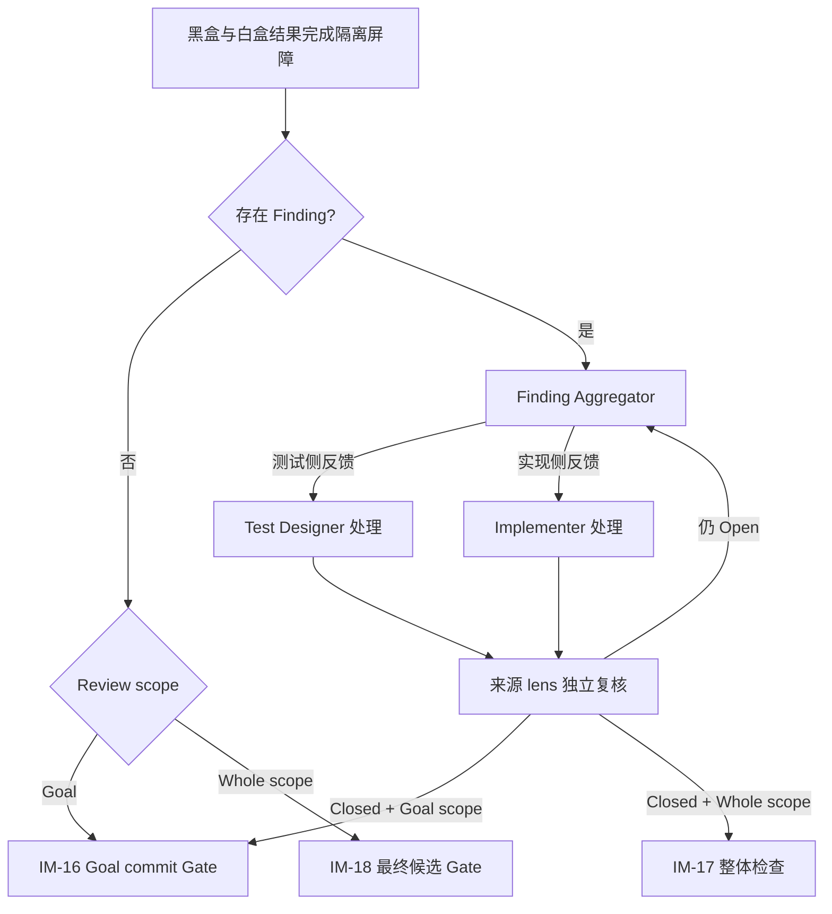
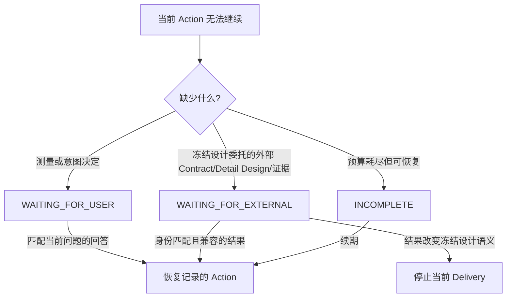

# Implementation Workflow Execution Guide

本文面向审阅和操作 Workflow 的人，回答“正常怎样推进、关键循环在哪里、异常如何返回”。它不重定义状态机；Action、Gate、合法 successor 和终态以 [`workflow.md`](workflow.md) 为唯一权威。

## 1. 核心流程

核心路径先证明任务可测、冻结全部 Goal，再逐个交付 Goal，最后验证组合后的完整候选。



这条路径有五个不可跳过的边界：

1. Preflight 必须证明设计身份、干净 Git baseline 和可运行 Harness。
2. TDD 前的可行性校准只解决实现版本/SDK/substrate 事实；推翻设计时停止，不在本流程内改架构。
3. 人工确认的是完整 Goal Graph、测量标准和 Test Ladder，不是某个临时实现方案。
4. 每个 Goal 只有在测试、对抗检查和 Finding 闭合后才形成绿灯 commit。
5. 所有 Goal 完成只代表可以进入整体检查；不代表 Workflow 已成功。

上游义务按本 Workflow 分类：跨 owner Contract 阻塞依赖 Goal；实现可行性在 TDD 前校准；实现验证进入 Test Ladder；运行调优在候选形成后 handoff，除非冻结设计提供必须在实现期满足的 Fitness Threshold。

## 2. 单个 Goal 的演进式 TDD 循环

每个 Goal 从最核心的可观察行为开始，通过 Test Ladder 逐层替换 stub、补齐场景和分支正确性。原型不是绕过 TDD 的一次性代码，而是每一轮 RED/GREEN 后保留下来继续演进的交付件。



正式测试只由 Test Designer 修改，生产实现只由 Implementer 修改。CLI 以各自 Action 开始时的 Git tree 为基线检查 staged、unstaged、rename、delete 和 untracked path。Implementer 若认为测试有误，只能产生修订请求，不能直接改测试。

## 3. Finding 与来源 lens 复核

Goal 级和 whole-scope 审查共用处理机制，但闭合后返回的位置不同。



Aggregator 只保留来源、合并明显同因项和路由，不投票、不改 severity、不关闭 Finding。`BLOCKING`/`MAJOR` 必须关闭；`MINOR` 只能由来源 lens 修复、判定无效或明确接受。通用最佳实践若没有 Project Context 依据，只是 `REVIEW_SIGNAL`。

## 4. Wait、外部协调与停止



Implementation Workflow 永远不自行启动 System Design、Module Detailed Design 或 Spike Workflow。它只发布 External Coordination Request 并等待外部 Delivery。新结果若推翻冻结设计，当前 Delivery 不吸收变更，而是停止并要求新的 Implementation Delivery。

## 5. Git 与完成边界

```text
clean baseline → feature branch → verified Goal commit(s) → verified local candidate
```

- RED 和中断状态只保存在 ignored run workspace/checkpoint，不形成 commit。
- 一个 Goal 完整绿灯并通过独立审查后必须 commit。
- `VERIFIED_IMPLEMENTATION_READY` 是本地 feature branch 候选。
- push、PR、merge 和部署都不是默认成功条件；只有用户明确要求时才在核心 Workflow 之外执行。

## 6. 如何查阅精确定义

需要判断执行细节时按以下顺序读取：

1. [`workflow.md`](workflow.md) 的 transition table 和 Action Catalog；
2. [`agents/routes.md`](agents/routes.md) 的 Role、Prompt、Skill 与 session binding；
3. [`schemas/`](schemas/) 与 [`templates/`](templates/) 的 Artifact 结构；
4. [`validators/`](validators/) 和 [`conformance/`](conformance/) 的 Gate 与证明场景。

过程文件、Snapshot、State、Git deliverable 和 cleanup 的详细边界见 [`artifact-lifecycle.md`](artifact-lifecycle.md)。

本文中的图用于理解。如果图与上述权威资源不一致，应当修正文档图，而不是改变执行语义。
