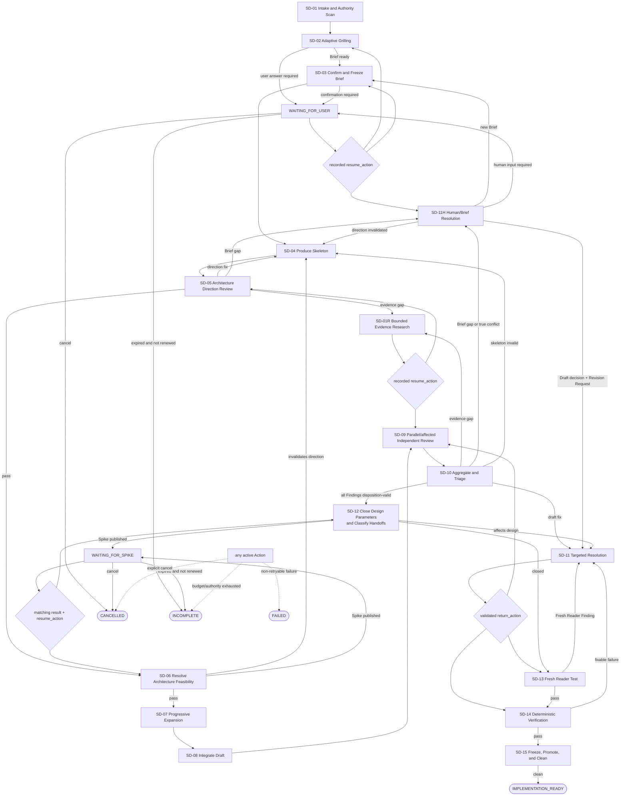

# System Design Workflow Definition

## 1. 目标与终态

本 Workflow 将简短 Intake、项目权威材料和用户意见，转化为一份能够说明“解决什么问题、为何这样设计、如何证明适合当前项目”的 System Design。

成功终态只有 `IMPLEMENTATION_READY`。预算耗尽或外部 authority 缺失进入可恢复的 `INCOMPLETE`；明确取消进入 `CANCELLED`；不可重试的执行/配置失败进入 `FAILED`。三者都不等价于成功。

完成必须同时满足：

- Confirmed Design Brief 已冻结；
- Skeleton 的架构方向和技术可行性已闭合；
- 完整 Design 通过三个相互独立的 adversarial review；
- Blocking/Major Finding 均由对应 review lens 关闭，Minor 也已关闭或由 source lens 明确接受；
- 所有设计拥有的可行性与参数问题已闭合；所有下游义务已有 owner、影响范围、所需证据、return location 和设计 reopen 条件；
- Fresh Reader Test 与 deterministic verification 通过；
- 最终 Design 绑定精确 Git/artifact identity，且不处于 stale 状态；
- 必要 lineage/decision/review 结论已吸收到最终 Design，会话期 artifacts 已清理，Git 候选变更不包含中间文件。

## 2. Action Graph



## 3. Artifact Lifecycle

```text
Ignored run workspace:
Raw Intake → Confirmed Design Brief → Confirmed Skeleton
→ Working Design Draft/review/revision versions → DESIGN_REVIEWED candidate

Promotion and cleanup:
verified candidate → repository System Design
→ delete run-workspace intermediates → IMPLEMENTATION_READY
→ SUPERSEDED only after a later frozen version explicitly replaces it
```

Artifact maturity states are `WORKING → SKELETON_CONFIRMED → DESIGN_REVIEWED → IMPLEMENTATION_READY → SUPERSEDED`. `STALE_PENDING_IMPACT` is a dependency-validity state and can apply before any forward transition.

Logical versioning does not imply Git tracking. All pre-promotion artifacts and control/evidence records live under `tmp/system-design/<run-id>/` or an equivalent Runtime-private ignored location and use immutable content digests. Only the final Design and explicitly requested formal companions are repository deliverables. The final Design must be self-contained: it may name stable decisions and authoritative sources, but it must not require a deleted treatment, review transcript, question set, validator report, or freeze manifest to be understood or implemented.

Brief confirmation freezes that version. Later changes require a `BriefChangeRequest`, a fresh local-grilling session, user confirmation, and a new Brief version. The Runtime starts from direct references to changed identities and deterministically propagates invalidation through the transitive dependency closure; System Designer adds semantic impacts that explicit references did not capture but cannot shrink the deterministic invalidation set.

## 4. Action Catalog

### SD-01 Intake and Authority Scan

- **Purpose:** turn the initial one- or two-sentence request into an evidence-backed starting context.
- **Role:** Grilling Facilitator; read-only Scouts may support repository research.
- **Inputs:** user Intake, repository, prior authoritative conversations/artifacts.
- **Outputs:** authority map, initial Project Context Profile, facts, conflicts, and unknowns.
- **Gate:** derivable facts were investigated rather than converted into user questions.
- **Next:** `SD-02`.

### SD-01R Bounded Evidence Research

- **Purpose:** resolve one derivable factual gap without restarting Intake/Grilling or asking the user.
- **Role:** Evidence Scout, read-only.
- **Inputs:** exact Evidence Research Request, source authority, requesting Action/Finding, recorded `resume_action`, and exact `resume_lens` when returning to SD-09.
- **Output:** sources, observations, conflicts, confidence, and resolved/unresolved state.
- **Gate:** return only to the recorded requester: SD-05 direction review or the affected SD-09 review lens before aggregation resumes.

### SD-02 Adaptive Grilling

- **Purpose:** pressure-test requirements and guide the user until both sides clearly understand what is being built.
- **Role:** Grilling Facilitator in a dedicated session.
- **Resources:** shared `grilling`; Brief template as topic coverage map.
- **Method:** one question at a time; follow the user's answer; use solution hypotheses as probes without making architecture decisions. Each question/answer continues the same Action episode and admitted session through Action-scoped `awaiting-input`/`continueWithInput`; it does not create a Workflow Wait.
- **Outputs:** working Brief containing scenarios, opinions, priorities, project context, quality expectations, risks, acceptance intent, rejected interpretations, and classified unknowns.
- **Gate:** no design-significant ambiguity remains unclassified or ownerless.
- **Next:** `SD-03` or `INCOMPLETE` without lowering the closure standard. A Workflow Wait is available only after an Action has returned and explicitly requested an external approval/decision; ordinary SD-02 grilling remains inside the Action.

### SD-03 Confirm and Freeze Brief

- **Purpose:** turn the conversation into an explicit shared-understanding artifact.
- **Responsible authority:** Grilling Facilitator prepares/obtains confirmation; Runtime persists the user wait, validates identity, and freezes the artifact.
- **Procedure:** run Brief Closure Check; present decision-oriented summary and navigable topic index; allow follow-up; require explicit whole-Brief confirmation.
- **Output:** immutable Confirmed Design Brief version with run-workspace content digest, authoritative-source bindings, and topic identities.
- **Gate:** every fixed topic/subtopic has explicit status; design-significant derivable facts are resolved; no `USER_DECISION_REQUIRED` or `BLOCKED` remains. Non-blocking `DERIVABLE`, `DESIGN_EXPLORATION`, `TO_BE_MEASURED`, and `DEFERRED` items require owner, blocks, evidence, and return location.
- **Next:** `WAITING_FOR_USER` until explicit confirmation, then `SD-04`.

### SD-04 Produce System Design Skeleton

- **Purpose:** make the first formal architecture decisions before prose expansion.
- **Role:** System Designer in a session that does not inherit hidden grilling context.
- **Resources:** `system-design-authoring` and shared `codebase-design`.
- **Outputs:** problem decomposition, candidate/selected Modules, responsibility and state ownership, key relationships, design-driver mapping, major trade-offs, and View Plan.
- **Gate:** each Module hides meaningful complexity; no required scenario lacks an architectural path; quality scenarios already shape the direction.
- **Next:** `SD-05`.

### SD-05 Independent Architecture Direction Review

- **Purpose:** challenge the Skeleton before expensive expansion.
- **Role:** Architecture Reviewer, fresh read-only session.
- **Resources:** `architecture-review` and `codebase-design`.
- **Outcomes:** pass; return to Skeleton; request evidence; or create Brief Change Request.
- **Gate:** suspicious smells become Findings only after project-specific impact is evidenced.
- **Next:** `SD-04`, `SD-06`, `SD-01R`, or `SD-11H`.

### SD-06 Resolve Architecture Feasibility

- **Purpose:** close questions whose answer determines whether the Skeleton's technical direction is viable.
- **Responsible authority:** System Designer prepares the request and applies a valid result; Runtime publishes the external request, persists `WAITING_FOR_SPIKE`, correlates the matching result, and resumes SD-06.
- **Mechanism:** publish a Spike Request to the external Spike Workflow; do not execute the Spike inside an Agent Skill. Validate the returned Spike Result against its exact request, environment, method, and evidence binding before applying it.
- **Gate:** every architecture-feasibility result is applied; an invalidated Skeleton returns to `SD-04` and loses its prior review pass.
- **Next:** `WAITING_FOR_SPIKE`, then `SD-07` when feasibility is confirmed or `SD-04` when the result invalidates direction.

### SD-07 Progressive System Design Expansion

- **Purpose:** deepen the confirmed Skeleton in reasoning order.
- **Role:** one System Designer writer.
- **Order:** context/problem → decomposition/structure → collaboration/views → data/state/interfaces → system-wide mechanisms → contextual quality realization → risks/trade-offs/acceptance.
- **Rule:** save Draft checkpoints in the ignored run workspace; never mutate the frozen Brief; request local grilling for requirement-level gaps. Checkpoints are resumable working state, not Git deliverables.
- **Next:** `SD-08`.

### SD-08 Integrate Complete Draft

- **Purpose:** produce one coherent System Design using the formal template.
- **Role:** System Designer.
- **Checks:** terminology, human-first reading order, IDs, diagram/text parity, ownership, traceability, quality mechanisms, risks, decisions, Spike state, and acceptance plan. Lead with names/concepts, present one branch-free successful core before named exception scenarios, and move dense identity mappings out of behavioral prose.
- **Output:** versioned complete Draft in the ignored run workspace, suitable for independent review.
- **Next:** `SD-09`.

### SD-09 Parallel Independent Adversarial Review

All three sessions receive the required source artifacts but cannot see each other's analysis before the review barrier closes.

| Lens | Resources | Focus |
| --- | --- | --- |
| Problem–Solution | `problem-solution-review` | Brief/scenario/scope-to-design traceability |
| Architecture | `architecture-review`, `codebase-design` | Module, Interface, ownership, dependency, cleanliness; smells as signals only |
| Quality & Acceptance | `quality-acceptance-review` | contextual NFR, under/over-design, risk, thresholds, Spikes, evidence |

Each emits admitted Findings or non-blocking `REVIEW_SIGNAL`s. Results are not votes.

The first SD-09 pass initializes the selection source to all three declared lens identities and runs that selected set behind the barrier. Later recheck sets the same source to the affected non-empty subset only; `required:true` constrains each member of the current selected set, and the barrier waits only for that set. This is one static parallel topology with data-driven selection, not an `All|Selected` mode. Independence and fresh-session rules still apply.

### SD-10 Aggregate and Triage Findings

- **Role:** Finding Aggregator; no technical decision authority.
- **May:** merge corroborating Findings while preserving provenance; relate common causes; identify contradictions; route by evidence and affected stage.
- **Must not:** decide by majority, hide risk, inflate signals, change severity without returning to the Reviewer, or close Findings.
- **Routing:** evidence gap → `SD-01R` with `resume_action = SD-09` and the affected Reviewer/result in `resume_lens`; Brief problem → `SD-11H`; Skeleton invalid → `SD-04`; Draft issue → `SD-11`; true direction conflict → `SD-11H`; every admitted Finding disposition-valid → `SD-12`.

### SD-11 Targeted Resolution

- **Role:** System Designer.
- **Purpose:** consume one validated Revision Request from a Review Finding, Fresh Reader Finding, applied Spike result, confirmed Human Decision, or deterministic validation failure; revise only affected content while checking downstream consistency.
- **Finding closure:** Designer submits treatment and new Draft; the corresponding review lens rechecks in a fresh session with the original Finding and evidence. Designer cannot close its own Finding. Fresh Reader Findings return to SD-13 for fresh recheck and closure.
- **Non-Finding correction:** Spike/validator requests retain their origin identity; no artificial Review Finding is created.
- **Next:** Runtime validates `return_action` and invalidation state, then returns to affected SD-09 lens(es), SD-13, or SD-14. SD-09 is not the unconditional default.

### SD-11H Brief/Human Resolution

Two paths share the human boundary:

1. **Brief gap:** create Brief Change Request, run fresh local grilling against the frozen Brief, confirm a new Brief version, then invalidate dependants.
2. **True direction conflict:** admit a Human Decision Request only after evidence is exhausted and alternatives cannot coexist. Enter a multi-turn Decision Dialogue; allow questions and new options; do not interpret exploratory replies as decisions. Exit only with an explicit Human Decision Record. A decision that invalidates direction returns to SD-04; a Draft-level decision produces a `HUMAN_DECISION` Revision Request for SD-11.

At most one human decision is pending. Agent recommendations are required, but no Arbiter Agent replaces the human owner.

Ordinary initial/local grilling and explicit Brief confirmation are planned collaboration, not conflict escalation. The stricter Human Decision Admission rules apply when an unresolved design/review conflict asks the human to choose a direction.

- **Responsible authority:** Grilling Facilitator maintains dialogue/decision artifacts; Runtime persists `WAITING_FOR_USER`, correlates answers to the exact request, and resumes the recorded Action.

### SD-12 Close Design Parameters and Classify Downstream Handoffs

- **Purpose:** close empirical values that change Design semantics, then classify every remaining downstream obligation without choosing another Workflow's Action, Gate or terminal.
- **Responsible authority:** System Designer prepares requests for design-owned evidence, applies valid results, and records handoffs; Runtime owns external publication, durable wait/correlation, and resume for design-owned Spikes only.
- **Handoff:** each downstream obligation records identity, accountable owner, affected design identities, semantic dependency, required evidence, return location and design-reopen condition. A suggested consumer or lifecycle is non-authoritative guidance.
- **Gate:** no design-owned feasibility/parameter remains open; every downstream obligation is explicit and owner-complete. Contract publication, implementation feasibility/verification and runtime tuning may remain open for their consuming Workflow to classify, and cannot be reported as passed evidence.
- **Next:** `WAITING_FOR_SPIKE` for design-owned evidence, then `SD-13` when no Design content changes or `SD-11` with a validated Revision Request when the result affects Design/review evidence.

### SD-13 Fresh Reader Test

- **Role:** Fresh Reader in a context-isolated session.
- **Inputs:** candidate Design and questions derived from Brief/template; no grilling transcript or hidden author/reviewer context.
- **Focus:** can a downstream implementer understand problem, decomposition, flows, ownership, constraints, quality mechanisms, parameter status, and acceptance?
- **Boundary:** it finds ambiguity and hidden assumptions; it does not reopen architecture based on preference.
- **Finding closure:** admitted Fresh Reader Findings are rechecked and closed only by a fresh SD-13 session against the revised exact Design.
- **Next:** `SD-14` or `SD-11`.

### SD-14 Deterministic Final Verification

- **Responsible authority:** Runtime deterministic validator; no Agent Role or Skill.
- **Behavior:** run the checks defined under `validators/`. It validates identity, structure, links, IDs, readability heuristics, traceability, Finding/Spike state and lifecycle conditions. A fixable failure creates a `DETERMINISTIC_FAILURE` Revision Request whose return Action is SD-14. It does not judge architecture quality or project appropriateness.

### SD-15 Freeze, Promote, and Clean

- **Responsible authority:** Runtime lifecycle/identity authority; no Agent Role or Skill.
- **Behavior:** freeze the exact Design content and dependency closure in Workflow state; ensure all durable decisions, accepted risks, open work, acceptance mappings, downstream obligations and runtime-tuning handoffs are represented in the Design; promote only the final Design and explicitly requested formal companions to repository paths; then delete the run workspace's Brief/Skeleton/Draft/revision/review/question/aggregation/verification/freeze files.
- **Gate:** repository links in the Design resolve without session artifacts; no path under `docs/**/workflow-artifacts/` is created or tracked; Git index/worktree contains no workflow intermediate; cleanup succeeds. Only then may Runtime report `IMPLEMENTATION_READY`.
- **Supersession:** later feedback may mark the final Design stale/invalidated, but it becomes `SUPERSEDED` only when a later final Design explicitly replaces it; no separate tracked freeze manifest is required.

## 5. Unknown Classification

| State | Meaning | Workflow behavior |
| --- | --- | --- |
| `CONFIRMED` | shared understanding exists | may guide design |
| `DERIVABLE` | evidence can resolve it | investigate; do not ask user |
| `DESIGN_EXPLORATION` | System Design owns the trade-off | resolve in Skeleton/design |
| `TO_BE_MEASURED` | empirical evidence required | close it here only when it changes Design semantics; otherwise record a downstream handoff |
| `DEFERRED` | non-blocking with reopen condition | retain owner and return location |
| `USER_DECISION_REQUIRED` | user intent is required | continue grilling/decision dialogue |
| `BLOCKED` | missing external authority | enter recoverable `INCOMPLETE` |

## 6. Quality and Measurement Lifecycle

The fixed quality topics are explored through scenarios, not a generic questionnaire. Each topic is explicitly relevant, reasoned not applicable, derivable, to be measured, design exploration, user decision, or blocked.

- **Fitness Threshold:** an existing categorical or numeric pass/fail boundary derived from user experience, business rules, contracts, authority, or scenario reasoning.
- **Architecture Feasibility:** must close after Skeleton and before expansion.
- **Design-owned Parameter:** must close before `IMPLEMENTATION_READY` when its value changes Module boundaries, responsibilities, dependency direction, state ownership or a design mechanism.
- **Downstream Obligation:** remains explicit with owner, evidence need, semantic dependency, return location and design-reopen condition; its consuming Workflow owns lifecycle classification and terminal impact.
- **Runtime Tuning Parameter:** may close during test/runtime validation and reopens design if measured facts violate design assumptions.

## 7. Finding Admission and Severity

A Finding requires exact location, observed statement/omission, applicable project/Brief/design requirement, evidence, concrete impact, project-specific relevance, resolution direction, severity, and confidence.

| Severity | Meaning |
| --- | --- |
| `BLOCKING` | prevents reliable implementation or changes goal, boundary, core direction, or feasibility |
| `MAJOR` | leaves an important scenario, relationship, quality requirement, or acceptance chain open |
| `MINOR` | local non-semantic or low-impact issue |
| `REVIEW_SIGNAL` | investigation cue not yet admitted as a Finding; never blocks or escalates |

All admitted Findings must leave `OPEN` before `IMPLEMENTATION_READY`. The source review lens may mark a Minor `ACCEPTED_MINOR` only after recording why it does not change design meaning, implementation direction, or acceptance. Aggregator and Designer may propose disposition but cannot apply it.

## 8. Human Decision Admission

Human intervention is admitted only when all are true:

1. the request contains one exact decision;
2. available evidence has been exhausted;
3. at least two directions cannot simultaneously hold;
4. the choice materially changes boundary, responsibility, quality target, or architecture;
5. the human is the correct owner;
6. a complete Decision Packet includes claims, evidence, prior investigation, options, consequences, recommendation, affected identities, and return Action.

## 9. Session and Review Rules

- Grilling Facilitator and System Designer use different sessions.
- Local grilling starts a fresh session from explicit Brief/Change Request artifacts.
- Skeleton and final Architecture Review reuse Role/Skill, not session memory.
- Each final review lens is mutually isolated until the review barrier closes.
- Recheck starts fresh with original Finding, treatment, new Draft, and evidence.
- No hidden conversation is an authority source.
- Session artifacts are stored only in the ignored run workspace. Agent prompts may return artifact identities, never permission to promote them into Git.

## 10. Budget and INCOMPLETE

Question, research, feasibility, review, revision and decision-dialogue budgets are project/runtime policy. Exhaustion never relaxes a Gate. `INCOMPLETE` records current artifact identities, closed topics, unresolved issues, remaining Findings/Spikes, stop reason, resume Action and required input/budget.

## 11. Wait, Resume, Failure, and Cancellation

- `WAITING_FOR_USER` persists pending question/decision identity, evidence binding, dialogue history, and exact `resume_action`; only a correlated answer may resume it.
- `WAITING_FOR_SPIKE` persists the exact request identity/content digest, external execution correlation, deadline Gate, and exact `resume_action`; mismatched or duplicate results cannot advance state.
- Wait expiry is a deterministic policy event. If renewal/retry remains admitted, Runtime resumes the recorded Action to publish the same or a new versioned request; otherwise expiry enters resumable `INCOMPLETE` with the pending request and required next authority. Expiry is never success or silent cancellation.
- A retryable execution failure remains on the same Action with a new attempt identity and budget accounting.
- A non-retryable configuration/execution failure terminates `FAILED` with current artifacts and failure evidence.
- Explicit cancellation is durable `CANCELLED`; it preserves required lineage in Runtime state according to retention policy, not in Git, and cannot be reported as `INCOMPLETE` or success.
- `INCOMPLETE` is resumable from recorded state; `FAILED`/`CANCELLED` require a new authorized Delivery unless a future Contract explicitly defines reopening.
